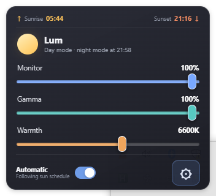
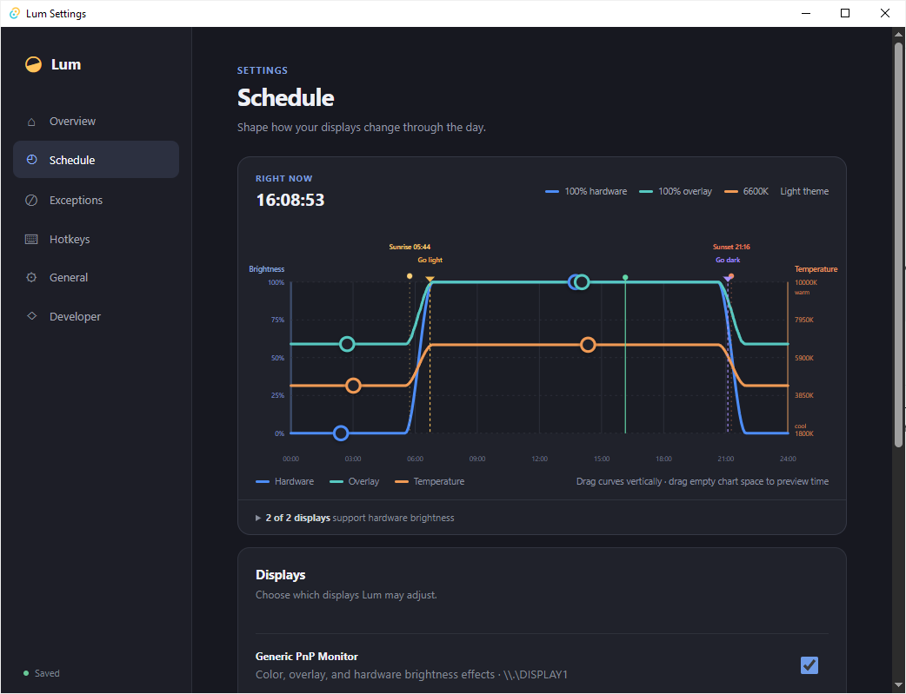

# Lum

Lum is a lightweight Windows tray app that adjusts monitor brightness, gamma, and color temperature with the sun.

Use the quick controls for temporary adjustments, or shape the daily schedule with editable curves. Lum supports DDC/CI hardware brightness, per-display exclusions, global hotkeys, and automatic light/dark theme switching.

## Quick controls



## Schedule



## Build

```powershell
npm install
npm run tauri build
```
